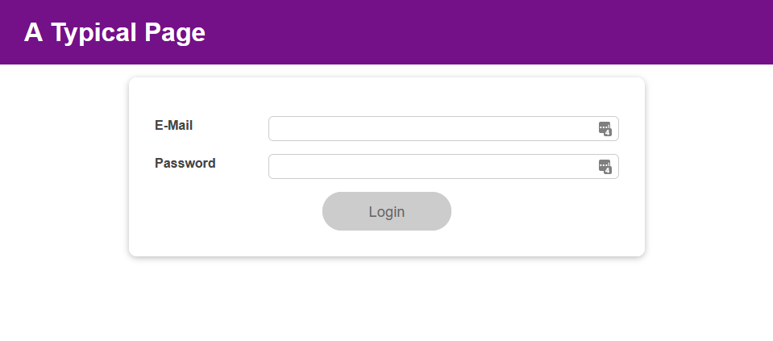

```
npm install
npm start
```
# Leksjoner

Tema:\
useEffect, useReduce, React context og useContext

Lagde en app som setter igang input validering så snart brukeren har tatt en «tastepause». Samler sammen lignende states i en reducer. Gjør properties tilgjengelig for alle children components med React context. Skulle også ordne slik at hvis man pårøver å logge inn mens et av input-feltene er ugyldige, vil input-feltet få focus.


Login form forhåndskode. Et UI som jeg måtte bygge funksjonalitet på.
